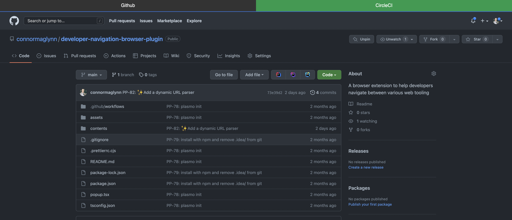

# Developer Navigation Plugin

A browser exstention that generates contextual links to relevant developer tooling.




---

## How it works

The plugin works by reading the current URL the browser has loaded and extracting out the Organisation and Project information from the URL.

Using this information, the plugin generates links to other tools by combining with the Organisation and Project with a base URL for other tools.

### Example

- **Current URL** = https://github.com/connormaglynn/developer-navigation-browser-plugin
- **Organisation** = connormaglynn
- **Project** = developer-navigation-browser-plugin
- **CircleCI URL Generated** = https://app.circleci.com/pipelines/github/connormaglynn/developer-navigation-browser-plugin?branch=main

### Supported Tools
- [x] Github
- [x] CircleCI
  - Defaults to main branch

---

## Running Locally For Development

### Clone this repository
```bash
git clone https://github.com/connormaglynn/developer-navigation-browser-plugin.git
```

### Install dependencies
```bash
npm install
```

### Start development build
This will create development build in **./build/chrome-mv3-dev** and a plasmo live reload session. So any changes made will be reflected instantly in the browser.
```bash
npm run dev
```

### Load development build in browser
- Go to **chrome://extensions/**
- Click **Load Unpacked**
- Select development build folder (**./build/chrome-mv3-dev**)

---
